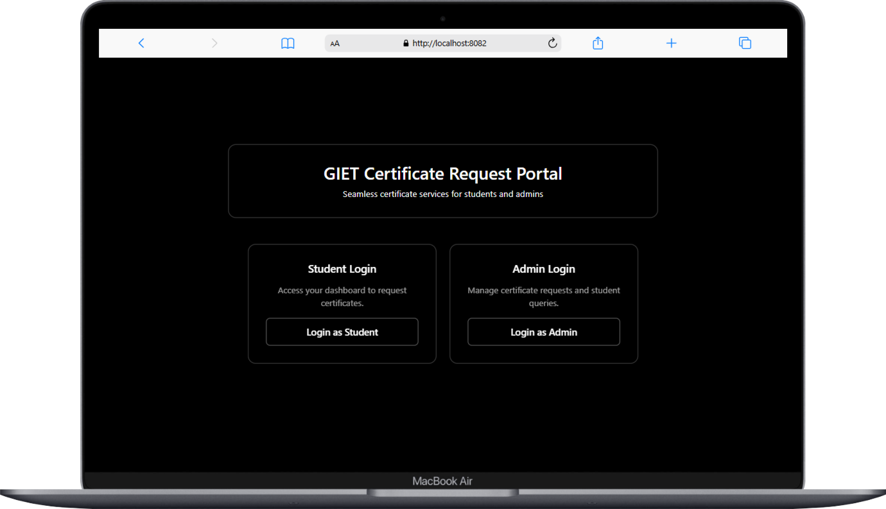
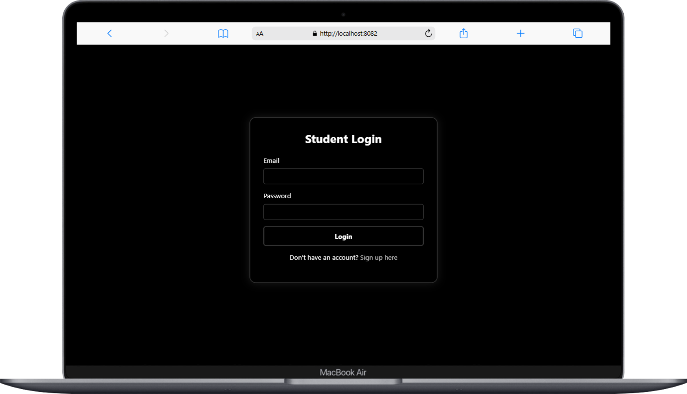
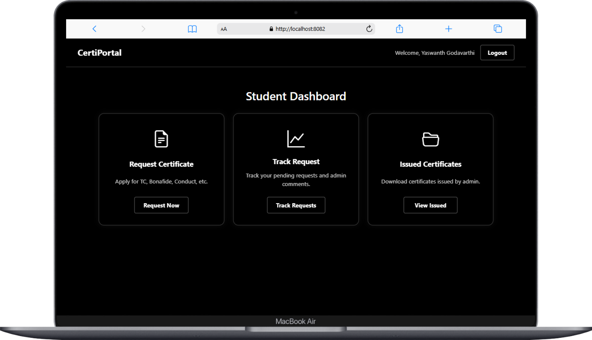
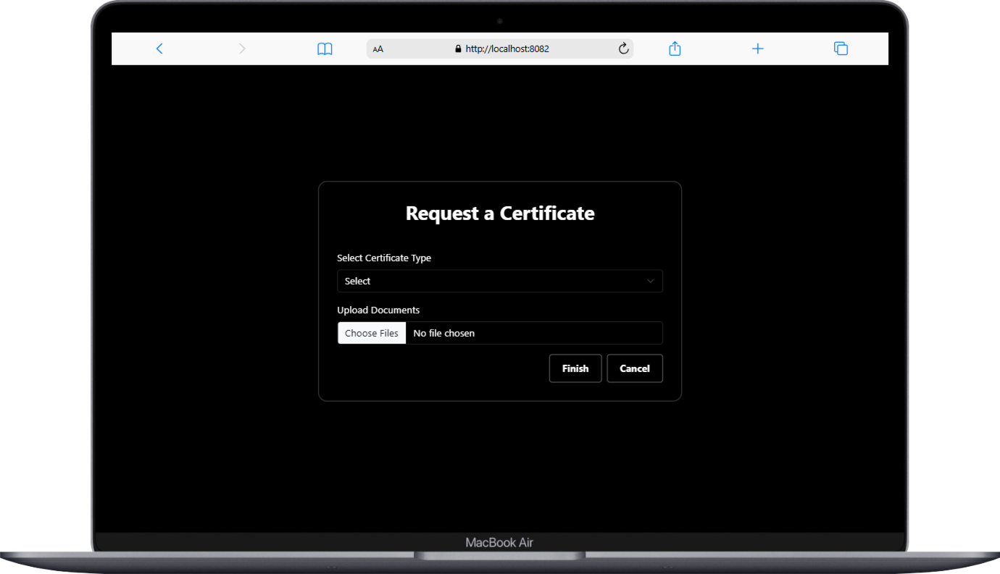
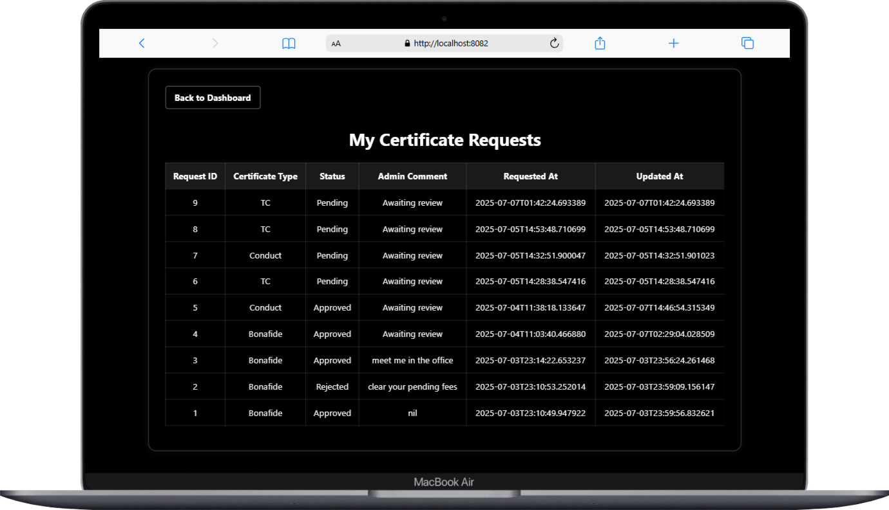
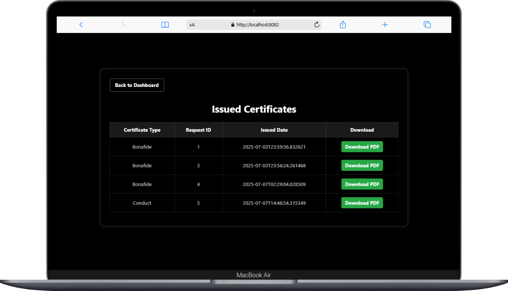
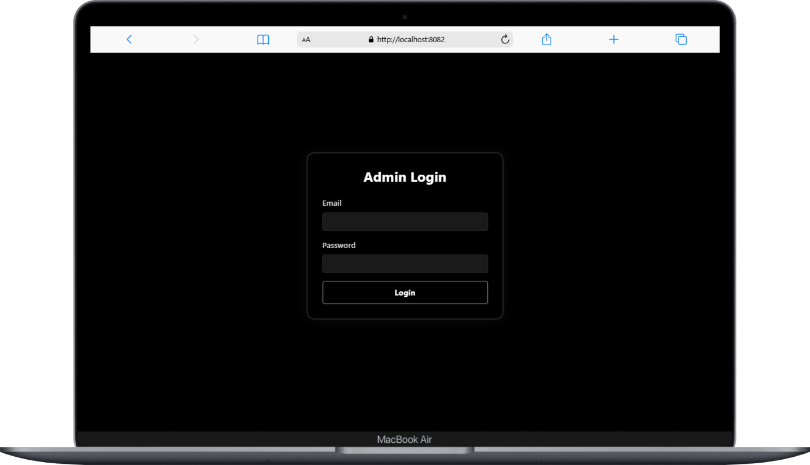
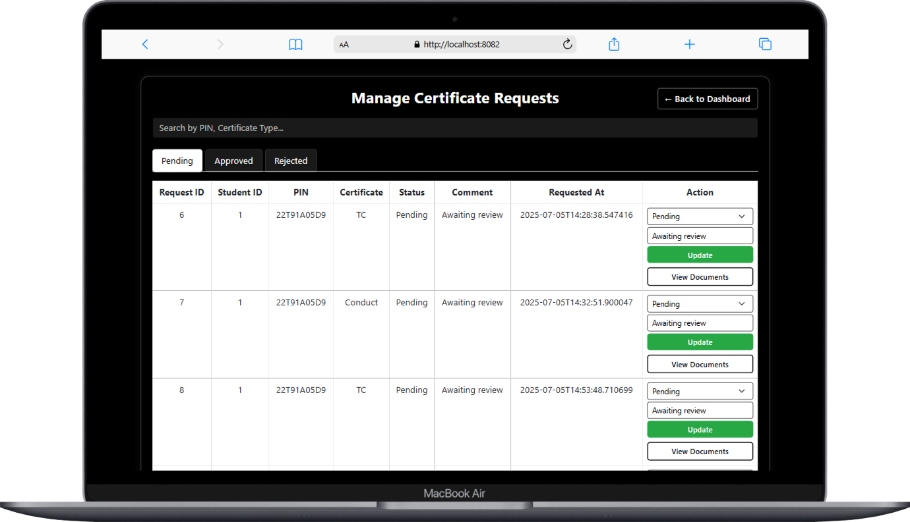

# Project Name: **CertiPortal – Student to Admin Certificate Request Portal**

A web-based application for students to request certificates and for college admins to process and issue them. Built using Java (JSP + Servlets), it provides a simple, structured way for certificate requests and tracking.

---

## Table of Contents

1. [Project Setup](#project-setup)  
2. [Technologies Used](#technologies-used)  
3. [Running the Project](#running-the-project)  
4. [Project Structure](#project-structure)  
5. [Screenshots](#screenshots)  
6. [Author](#author)  

---

## Project Setup

Before running the project, make sure the following are installed:

- **Java JDK** (8 or above)
- **Apache Tomcat** (v9 or above)
- **MySQL Server**
- **Eclipse IDE** (with Dynamic Web Project support)
- **Maven**

### 🛠️ Steps to Setup

1. **Clone or download** the project.
2. **Import as an existing project** in Eclipse (Dynamic Web Project or Maven Project).
3. **Create the MySQL Database:**
   - Name: `certiportal`
   - Import the schema using your SQL script.
4. **Configure DB Credentials:**
   - File: `StudentToOfficeDBConnection.java`
   - Update JDBC URL, username, password as per your setup.
5. **Deploy to Tomcat:**
   - Right-click project > Run on Server > Apache Tomcat
6. **Access the application:**
   - Student login: `http://localhost:8080/CertiPortal/student_login.jsp`
   - Admin login: `http://localhost:8080/CertiPortal/admin_login.jsp`

---

## Technologies Used

- **Frontend:** JSP, HTML, CSS, Bootstrap
- **Backend:** Java Servlets, JDBC
- **Database:** MySQL
- **Server:** Apache Tomcat
- **IDE:** Eclipse

---

## Running the Project

- Make sure MySQL and Tomcat servers are running.
- Ensure your project is deployed in Tomcat (via Eclipse).
- Open browser and access:
  - `http://localhost:8080/CertiPortal/index.jsp`

---

## Project Structure

```bash
CertiPortal/
├── pom.xml
├── README.md
├── src/
│   └── main/
│       ├── java/
│       │   ├── dao/
│       │   │   ├── AdminDAO.java
│       │   │   ├── RequestDAO.java
│       │   │   ├── RequestedFilesDAO.java
│       │   │   └── StudentDAO.java
│       │   ├── dbconnections/
│       │   │   └── StudentToOfficeDBConnection.java
│       │   ├── models/
│       │   │   ├── admin.java
│       │   │   ├── requested_files.java
│       │   │   ├── requests.java
│       │   │   └── student.java
│       │   └── servlet/
│       │       ├── AdminLoginServlet.java
│       │       ├── AdminLogoutServlet.java
│       │       ├── AdminUpdateRequestServlet.java
│       │       ├── GenerateCertificateServlet.java
│       │       ├── RequestCertificateServlet.java
│       │       ├── StudentLoginServlet.java
│       │       ├── StudentLogoutServlet.java
│       │       ├── StudentRegisterServlet.java
│       │       ├── UploadFileServlet.java
│       │       ├── ViewDocumentsServlet.java
│       │       └── ViewRequestDocumentsServlet.java
│       ├── resources/
│       └── webapp/
│           ├── admin_dashboard.jsp
│           ├── admin_login.jsp
│           ├── index.jsp
│           ├── request_certificate.jsp
│           ├── student_dashboard.jsp
│           ├── student_issued_certificates.jsp
│           ├── student_login.jsp
│           ├── student_register.jsp
│           ├── student_track_requests.jsp
│           ├── view_documents.jsp
│           ├── view_requests.jsp
│           ├── images/
│           │   └── giet-campus.jpg
│           └── WEB-INF/
│               └── web.xml
```

## Screenshots

|  |  |  |  |
| -------------------------------------- | -------------------------------------- | -------------------------------------- | -------------------------------------- |


|  |  |  |  |
| -------------------------------------- | -------------------------------------- | -------------------------------------- | -------------------------------------- |
